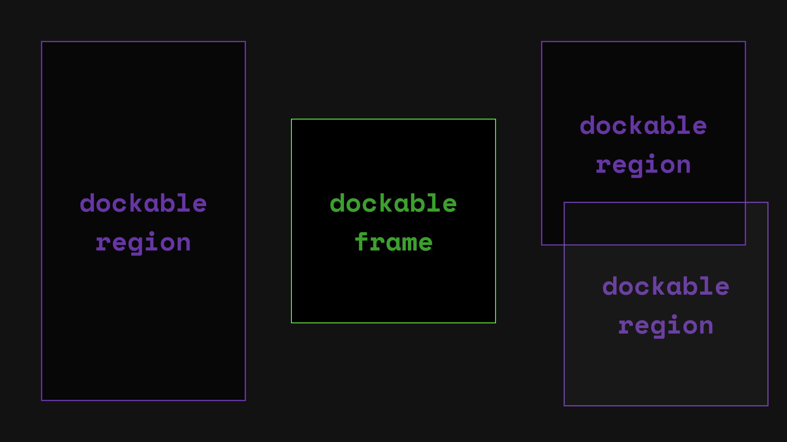

import { Card } from '@astrojs/starlight/components';

### Understanding Dodging
Dodging occurs when a DockableFrame, intended for a specific region, inadvertently docks into an adjacent region due to proximity. 
This typically happens when the regions are closely spaced.

DockableFrames can dock to regions of the screen. If these regions are too close together DockableFrames may "dodge" where they're intended to go.


### Avoiding Dodging

1. Space Out Regions: Ensure that the docking regions are adequately spaced apart to minimize the risk of accidental docking into neighboring regions.
<Card>

In the image above, if you attempt to drag the DockableFrame to the right, it might unintentionally dock into the adjacent region due to their close proximity.
</Card>

2. Adjust the dockingTolerance:
```tsx {5-6} title="app.tsx"
<RootProvider options={{ dockingTolerance: 20 }}>
...
</RootProvider>
```
This can help mitigate dodging issues by requiring more deliberate movement to initiate docking.